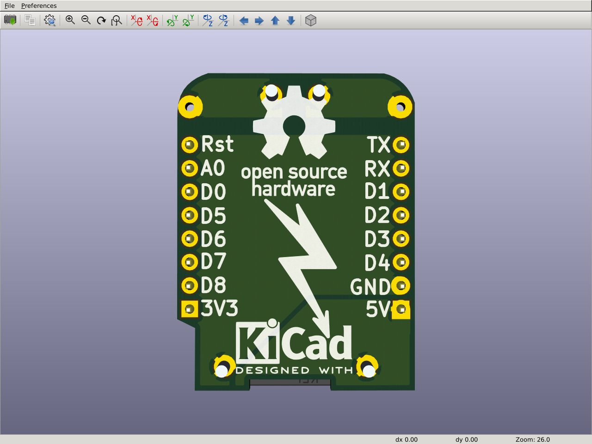
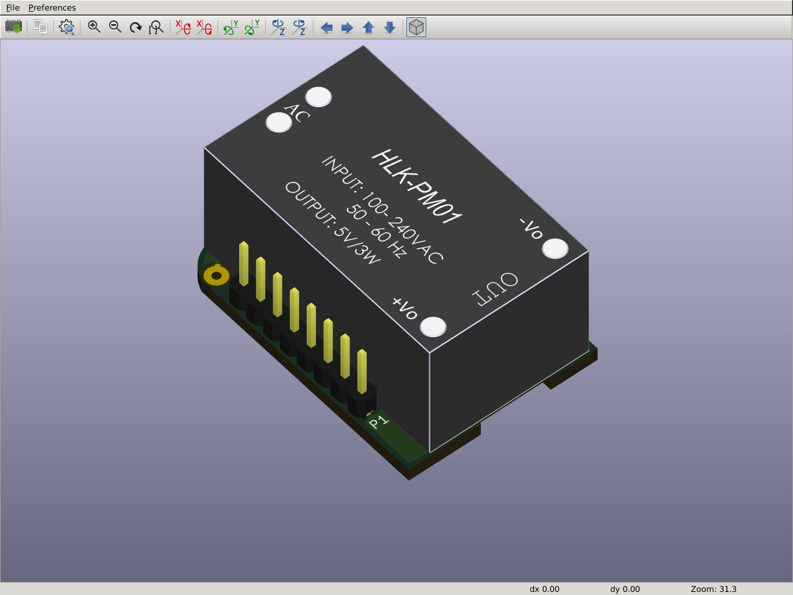
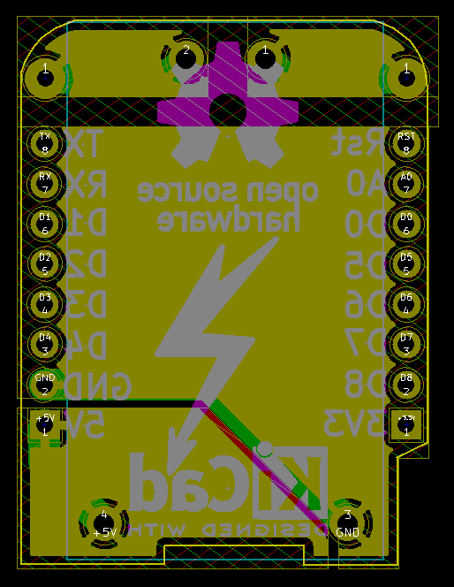
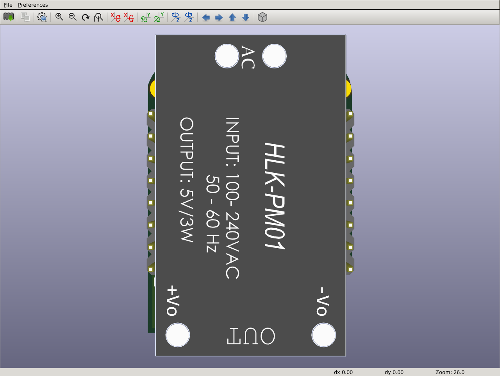

# AC power shield for Wemos D1 Mini (HLK-PM01)

Based on the shields template for [Wemos D1 Mini by Jérôme Labidurie.](https://github.com/jerome-labidurie/d1_mini_kicad)

## What does it do?
The HLK-PM01 is a single module AC-DC converter, converting 100VAC / 240VAC to 5VDC.

This is simply a shield, which fits the module, to power the Wemos D1 Mini from
AC power lines.

## What does it look like?

